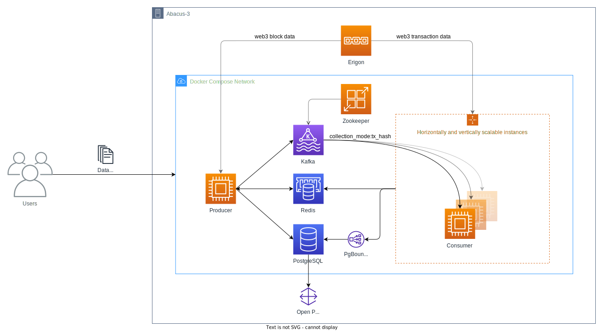

# EVM-compatible blockchain data collection

[](https://github.com/uzh-eth-mp/app/actions/workflows/test-unit.yaml)
[](https://github.com/uzh-eth-mp/app/actions/workflows/test-database.yaml)
[](https://uzh-eth-mp.github.io/app/)
[](https://github.com/uzh-eth-mp/app/releases/)
[](https://github.com/psf/black)
[](https://github.com/pre-commit/pre-commit)

A collection of Docker Containers and their orchestration for collecting EVM-compatible blockchains' data.

* [Overview](#overview)
* [Usage](#usage)
    * [Requirements](#requirements)
    * [Quickstart](#quickstart)
    * [Deployment Environment](#deployment-environment)
    * [Configuration](#configuration)
* [Features](#features)
    * [Scripts](#scripts)
    * [Querying data](#querying-data)
    * [Extensions](#extensions)
    * [Tools](#tools)
* [Documentation](#documentation)
* [FAQ](#faq)
* [Contributing](#contributing)
* [License](/LICENSE)

## Overview



Main components (Docker containers):

* Producer - scrape block data from the node and propagate transactions to Kafka
* Consumers - save relevant transaction data to the database
* Kafka - event store for transaction hashes
* PostgreSQL - persistent data store
* Redis - cache for orchestration data between producer and consumers

## Usage
The containers are orchestrated by docker compose yaml files. For convenience a set of bash scripts has been provided for easily running the data collection process.

### Requirements
* [`docker compose`](https://docs.docker.com/compose/#compose-v2-and-the-new-docker-compose-command) (v2.14.0+)
    * to use with abacus-3: [install the compose plugin manually](https://docs.docker.com/compose/install/linux/#install-the-plugin-manually).

### Quickstart 🚀
Compose files should be started with run scripts that can be found in the `scripts/` directory. For this you also need to have an `.env` file present. If you are cloning this directory, use `cp .env.default .env` and update env variables according to your needs. Then to start the collection with the development environment for Ethereum:

```
$ bash scripts/run-dev-eth.sh
# use CTRL+C once to gracefully exit (with automatic docker compose down cleanup)
```

Check the [docs](docs/example.md) for a more in-depth example with configuration and output.

### Deployment Environment 🏙️
There are two deployment environments available for the collection process.

* **Development** = use for development of new features
    * `$ bash scripts/run-dev-eth.sh`
    * exit with CTRL+C, followed by an automatic cleanup via `docker compose down`
    * config file: [`src/data_collection/etc/cfg/dev`](src/data_collection/etc/cfg/dev/)
* **Production** = intended for long running collection of data (Abacus-3)
    * `$ bash scripts/run-prod-eth.sh`
    * CTRL+C only closes the logs output, containers continue running. Stopping and removing of containers is manual!
    * config file: [`src/data_collection/etc/cfg/prod`](src/data_collection/etc/cfg/prod/)

There are some minor differences between a development and production environment besides the configuration files. Details can be found in the [scripts directory](scripts/README.md).

### Configuration 🏗️
Two main configuration sources (files):

1. `.env` = static configuration variables (data directory, connection URLs, credentials, timeout settings, ...)
2. `src/data_collection/etc/cfg/<environment>/<blockchain>.json` = data collection configuration (block range, data collection mode, addresses, events, ...)

For more, check the [configuration guide](docs/configuration.md).

## Features

* EVM compatible blockchains supported ☑️
* Multiple data collection modes (partial, full, get_logs, ...) ☑️
* `trace_Block` and `trace_replayTransaction` data included ☑️
* Parallelization of producers and consumers (multiple modes can run at the same time) ☑️
* Collect data on multiple blockchains at the same time ☑️
* Configurable timeouts for consumers and retries for web3 requests ☑️
* Single SQL database across all chains ☑️
* Add your own Events, contract ABIs and more...

### Scripts 📜
The [scripts/](scripts/) directory contains bash scripts that mostly consist of docker compose commands. These scripts are used for orchestrating the whole application.

### Querying Data 📁
To query the collected data from the database you will need a running PostgreSQL service. To start one, use:
```
$ bash scripts/run-db.sh
```

To connect to the running database, from another terminal window:
```
$ docker exec -it <project_name>-db-1 psql <postgresql_dsn>
```

Then you can easily execute SQL statements in the psql CLI:
```
db=# \dt+ eth*;
...
(10 rows)
```
More details on how to connect can be found in the [src/db/](src/db/README.md) directory.

### Extensions 🚧
If you'd like to extend the current data collection functionality, such as:

* adding a new web3 `Event` to store in the db or to process (e.g. [OwnershipTransferred](https://docs.openzeppelin.com/contracts/2.x/api/ownership#Ownable-OwnershipTransferred-address-address-))
* adding a new contract ABI (e.g. [cETH](https://compound.finance/Developers/abi/mainnet/cETH))
* adding a new data collection mode (e.g. LogFilter)
* supporting more blockchains than ETH and BSC

Please check out the [functionality extension guide](docs/extensions.md).

### Tools 🛠️
The [etc/](etc/) directory contains a few python scripts that can be used for various tasks:

1. [get_top_uniswap_pairs.py](etc/get_top_uniswap_pairs.py) = print top `n` uniswap pairs in a JSON format ready to be plugged into the data collection cfg.json
2. [query_tool.py](etc/query_tool.py) = CLI with predefined SQL queries for easily accessing the DB data (e.g for plotting).
3. [web3_method_benchmark.py](etc/web3_method_benchmark.py) = request response time benchmarking tool

## Documentation 📗
Most python code is documented with google docstrings and [handsdown](https://github.com/vemel/handsdown) is used as a docgen [https://uzh-eth-mp.github.io/app/](https://uzh-eth-mp.github.io/app/).

## FAQ 🙋🏻
A list of frequently asked questions and their answers can be found [here](docs/faq.md).

## Contributing 🥷🏻
Contributions are welcome and appreciated. Please follow the convention and rules described [here](docs/contributing.md).
