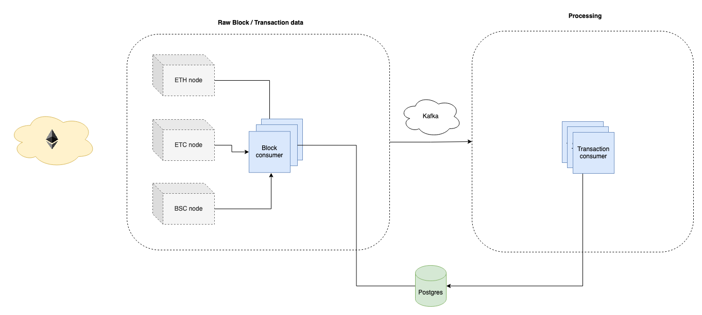

# Blockchain data collection and processing

## Overview
The app consists of four main components:
  * Block consumer - scrape block data from the nodes and propagate to a message queue
  * Transaction consumer - save data from transactions to the database
  * Message queue - Kafka
  * Database - PostgreSQL



The block / transaction consumers are blockchain agnostic / evm compatible, thus only require a configuration file to specify which blockchain should be mined for data and stored later.

## Running the app
The application stack is managed by docker-compose. Each compose configuration file targets a different environment.

### Development
The development build creates a local PostgreSQL database and connects to public blockchain node APIs.

To run a development build:
```
docker-compose -f docker-compose.yml -f docker-compose.dev.yml up
```

### Production
The production build expects a database / local blockchain nodes to be already reachable.

To run a production build:
```
$ docker-compose -f docker-compose.yml -f docker-compose.prod.yml up
```

### Per node dev/prod config
You can also run the app only for a specific blockchain.
```
# ETH
$ docker-compose -f docker-compose.yml -f <dev/prod.yml> --profile eth up
# BSC
$ docker-compose -f docker-compose.yml -f <dev/prod.yml> --profile bsc up
# ETC
$ docker-compose -f docker-compose.yml -f <dev/prod.yml> --profile etc up
```
